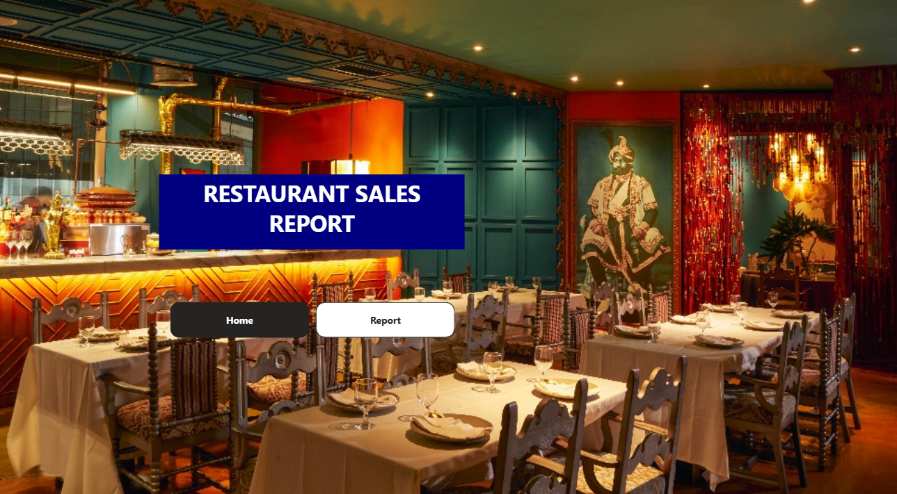
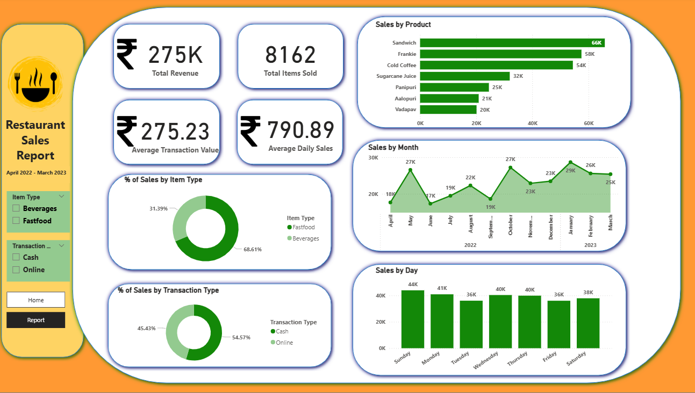

# Restaurant-Sales-Report

This project assesses the performance of an Indian restaurant using key performance indicators (KPIs) such as total revenue, total sales, and the most-sold product. The dataset, which is from Kaggle, is based on an Indian restaurant. The data was first cleaned in PostgreSQL (pgAdmin 4), and then Power BI was used to create the dashboard.

# Tools & Dataset
- Tools: PostgreSQL (pgAdmin 4), Power BI Desktop
-	Dataset: [Kaggle](https://www.kaggle.com/datasets/rajatsurana979/fast-food-sales-report)

# Data Cleaning in PostgreSQL
The CSV file from Kaggle was cleaned in PostgreSQL to ensure accuracy and consistency. This included:
-	Changing `NULL` values to “Unknown”
-	Checked for and deleted duplicate rows while keeping the first occurrence
-	Standardized text using `TRIM()` and `INITCAP()`

# Dashboard Objectives
The dashboard was created to answer questions and identify the restaurant's KPIs. The objectives were to determine:
-	The total revenue for one year
-	The total number of products sold 
-	Which month had the highest sales 
-	Which product had the highest sales 
-	Which day of the week had the highest sales 
-	If customers prefer cash or online payments 
-	If customers prefer fast food products or beverages

# Dashboard Preview

# Key Insights
-	The total revenue of the restaurant is 275,000 Indian Rupees.
-	A total of 8,162 items were sold.
-	The highest sales month was January 2023, with sales reaching 29,000 Indian Rupees.
-	Customers prefer paying with cash (54.57%) over online payments (45.43%).
-	 Fast food items are sold more frequently, with a 68.61% share of sales, which was consistent throughout the year.
-	Sundays had the highest sales, reaching up to 44,000 Rupees.
-	The average customer transaction is 275.23 Rupees.
-	The average daily sales amount is 790.89 Rupees.
-	The Sandwich was the most-bought item, with cumulative sales reaching 66,000 Indian Rupees.
